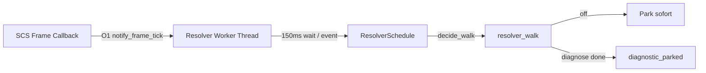

# ETS2-DLL Route-Resolver — Safety-Baseline (Stutter-frei, Default OFF)

Produktionssichere Baseline für `truckpilot_telemetry.dll` (ETS2 1.60). **Ohne Enable-Datei** läuft der Route-Resolver im Crash-Safe-Modus: kein synchroner Resolver im Frame-Callback, keine Pattern-Scans, keine Route-Memory-Reads.

Diese Datei ist der Vertrag für spätere Arbeit — Änderungen, die diese Invarianten brechen, gelten als Regression.

## 1. Default-Verhalten (ohne Enable-Datei)

| Aspekt | Verhalten |
|--------|-----------|
| Resolver-Modus | `off` (`RouteResolverMode::SafeDefault`) |
| Enable-Datei nötig? | **Nein** — Default ist sicher |
| SHM / RouteBlackboard | **Aktiv** — leere Route, Telemetrie, Status-Codes |
| Pattern-Scans | **0** pro Session |
| Memory-Route-Reads | **0** (Resolver blockiert) |
| Frame-Callback | O(1): nur `notify_frame_tick`, kein `resolver_walk` |

**SHM-Status (Default):**

```text
route_resolve_attempts=0
route_resolve_status=route_resolver_disabled_safe_mode
hint=route resolver disabled in crash-safe mode
```

Status-Code: **46** (`RESOLVE_ROUTE_RESOLVER_DISABLED_SAFE_MODE`).

**Sidecar-Log (Default):**

```text
route resolver worker started
route resolver mode=off
route resolver disabled safe mode
route resolver worker parked
```

Legacy-Datei `truckpilot_route_scan.enable` wird **ignoriert** (nur die neuen `truckpilot_route_resolver.*`-Dateien zählen).

## 2. Enable-Dateien und Priorität

Leere Dateien im ETS2-Plugin-Verzeichnis (`bin/win_x64/plugins/` neben der DLL):

| Datei | Modus | Sidecar-Label |
|-------|-------|---------------|
| `truckpilot_route_resolver.full` | Full deep scan | `full` |
| `truckpilot_route_resolver.static` | Static chain only | `static` |
| `truckpilot_route_resolver.route_candidate_table` | Kandidaten-Tabellen (one-shot) | `route_candidate_table` |
| `truckpilot_route_resolver.game_ctrl_table` | `game_ctrl+0x0000..0x5000` dump | `game_ctrl_table` |
| `truckpilot_route_resolver.gps_table` | `gps+0x00..0x100` dump | `gps_table` |
| *(keine Datei)* | Safe default | `off` |

**Priorität (höchste gewinnt):**  
`full` > `static` > `route_candidate_table` > `game_ctrl_table` > `gps_table` > `off`

Implementierung: `crates/telemetry-dll/src/safe_mem.rs` (`RESOLVER_ENABLE_FILES`, `detect_resolver_mode_selection`).

## 3. Stutter-Fix — Architektur



| Mechanismus | Datei | Zweck |
|-------------|-------|-------|
| Frame O(1) | `lib.rs` → `dispatch_route_tick` → `resolver_worker::notify_frame_tick` | Kein synchroner Resolver |
| Worker-Thread | `resolver_worker.rs` | 150 ms Wait, Wake-Event |
| Backoff | `resolver_sched.rs` | 2s → 4s → … → 60s nach Fehlversuchen |
| Pattern-Limit | `resolver_sched.rs` | Max **5** Pattern-Scans/Session, dann Park |
| Diagnose-Park | `nav_route.rs` | Table-Modi one-shot, danach `diagnostic_parked` |
| Session-Cache | `nav_resolve.rs` | `GameCtrlSessionCache` — kein Re-Scan pro Frame |

## 4. Safety-Invariants (Regression-Tests)

Diese Invarianten **dürfen nicht gebrochen werden**:

1. **Frame-Callback ruft keinen Resolver synchron auf** — nur `notify_frame_tick`.
2. **Pattern-Scans aus dem Frame-Pfad bleiben 0** — Scans nur im Worker bei aktivem Modus.
3. **Off-Modus:** 0 Pattern-Scans, 0 Tabellenreads, 0 Chain-Walks (`block_if_resolver_off`).
4. **Diagnosemodi:** one-shot + `park_diagnostic_done` — Worker parkt danach.

Tests: `production_safety_tests.rs`, `offline_stutter_tests.rs`, `resolver_metrics` Zähler.

## 5. Manuelle Default-Verifikation (PowerShell)

Voraussetzung: ETS2 mit deployter DLL, **keine** `truckpilot_route_resolver.*`-Dateien im Plugin-Ordner.

```powershell
# Sidecar-Log (Pfad je nach Setup)
Get-Content "$env:USERPROFILE\Documents\Euro Truck Simulator 2\truckpilot_telemetry.log" -Tail 30

# Erwartung: mode=off, disabled safe mode, worker parked

# SHM-Dump (Daemon optional)
cargo run -p truckpilot-telemetry --bin route-shm-dump
# Erwartung: route_resolve_status=46, hint enthält "crash-safe mode"
```

Offline ohne ETS2:

```powershell
cargo test -p truckpilot-telemetry-dll production_safety
cargo test -p truckpilot-telemetry-dll offline_stutter
```

## 6. Diagnosemodus-Verifikation (`route_candidate_table`)

Nur für gezielte Offline-Forschung — **nicht** für Produktion.

```powershell
# Leere Enable-Datei anlegen (ETS2 Plugin-Ordner)
New-Item -ItemType File -Path "...\bin\win_x64\plugins\truckpilot_route_resolver.route_candidate_table" -Force
```

Nach einem Spielstart mit aktiver Route (Diagnose one-shot):

```text
route resolver mode=route_candidate_table
module scan success ... gps_slot_value=0x0
candidate source game_ctrl+0x... 
candidate table done source=+0x... slots=33 nonzero=...
resolver attempt count=N status=route_candidate_table_done
route resolver worker parked
```

Danach keine weiteren Resolver-Walks bis Enable-Datei geändert/neu gestartet.

## 7. Bekannte 1.60-Befunde

Aus echtem `route_candidate_table`-Sidecar (ETS2 1.60):

| Befund | Bedeutung |
|--------|-----------|
| `gps_slot_value=0x0` | GPS-Route-Slot leer trotz geplanter Route |
| `game_ctrl + 0x3E30 = 0` | Kein Route-Root an erwarteter Offset-Position |
| Kandidaten +0x3AC0 … +0x4580 | Überwiegend **Inventory / Asset / Text / Container** |
| +0x4228 / +0x4230 | Gleicher Zeiger, Self-Ref-Container — **nicht route-like** |

**Empfehlung:** Keine tieferen Derefs auf diese Kandidaten. Neue 1.60-Signatur/Root **offline** suchen (Pattern-Scan, Reversing), nicht live im Frame-Pfad.

## 8. Offline-Log-Analyse (`route-log-analyze`)

Sidecar-Log speichern und offline klassifizieren — **ohne ETS2, ohne Live-Reads**.

```powershell
cargo run -p truckpilot-telemetry --bin route-log-analyze -- path\to\truckpilot_telemetry.log
```

Fixture-Test (repräsentatives 1.60-Excerpt):

```powershell
cargo run -p truckpilot-telemetry --bin route-log-analyze -- `
  crates\telemetry\tests\fixtures\route_candidate_table_ets2_160_excerpt.log
```

Erwartete Summary:

```text
gps_slot_value=0x0
candidate +0x3AC0: null_table, route_like=false
candidate +0x4038: asset_or_inventory_text, route_like=false
...
summary:
route_like_candidates=0
recommended_next_step=do_not_deeper_deref; find new 1.60 signature/root offline
```

Integrationstest: `crates/telemetry/src/route_log_analyze/mod.rs` (`ets2_160_excerpt_fixture_integration`).

## 9. Offline-Test-Matrix (Baseline grün)

```powershell
cargo test -p truckpilot-telemetry-dll          # 153 passed (+ ignored/legacy)
cargo test -p truckpilot-telemetry            # inkl. route_log_analyze
cargo test -p truckpilot-telemetry --bin route-shm-dump
cargo check --workspace --all-targets
```

## 10. Tag / Release-Marker

Baseline-Tag für reproduzierbare Referenz:

```text
ets2-dll-safe-resolver-off-baseline
```

Commit-Empfehlung:

```text
Make ETS2 route resolver safe and non-blocking by default
```

## Verwandte Module

- `crates/telemetry-dll/src/safe_mem.rs` — Modus, Enable-Dateien
- `crates/telemetry-dll/src/resolver_worker.rs` — Worker-Entkopplung
- `crates/telemetry-dll/src/resolver_sched.rs` — Backoff, Limits, Park
- `crates/telemetry-dll/src/resolver_guard.rs` — Off-Mode Guards
- `crates/telemetry-dll/src/route_status.rs` — Status 41–46
- `crates/telemetry/src/route_log_analyze/` — Offline-Analyzer
